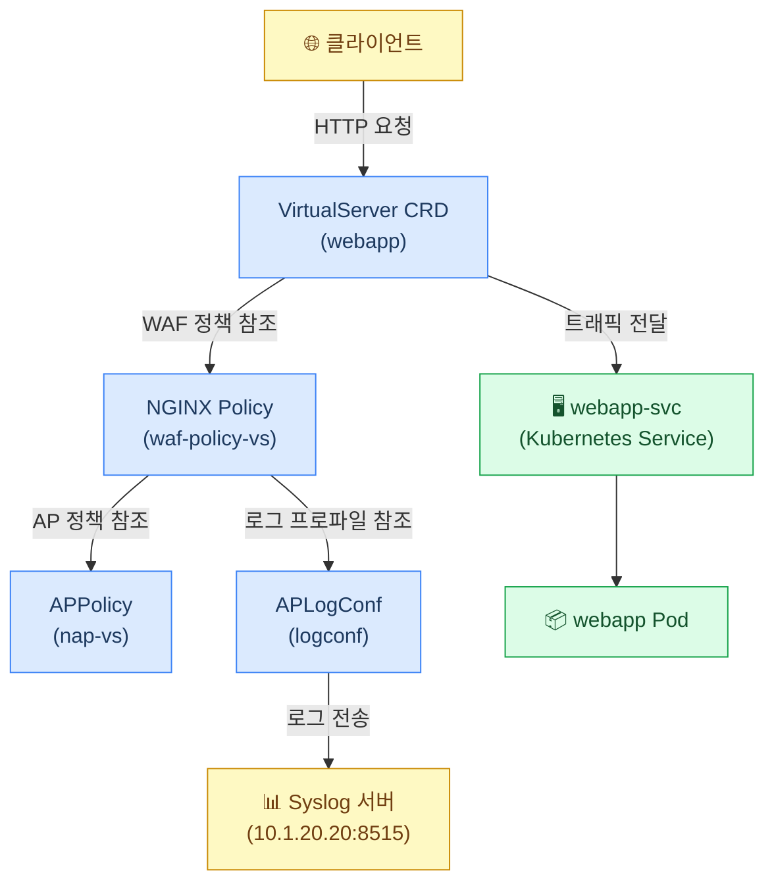
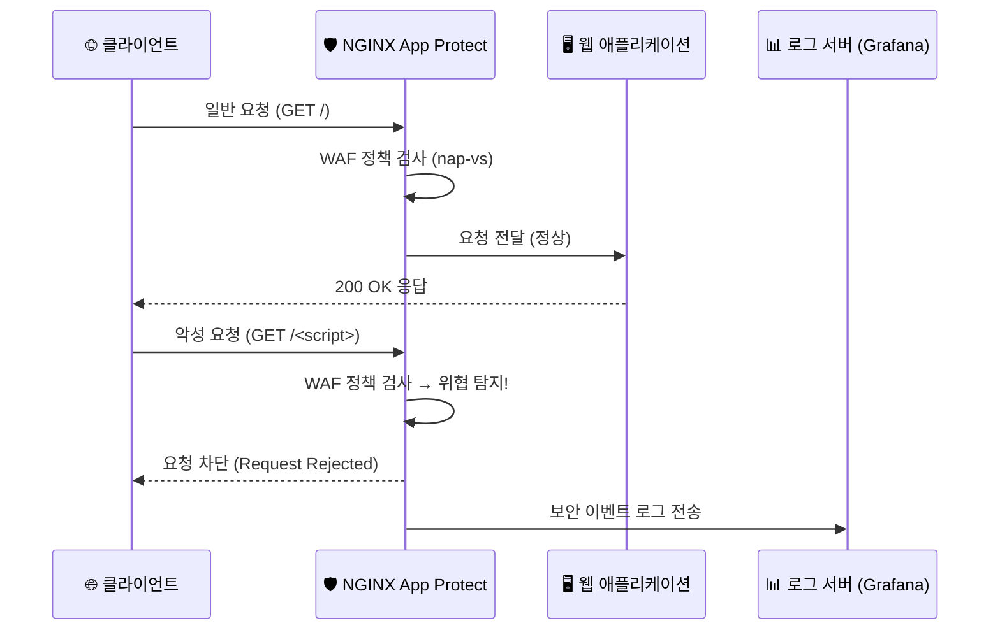
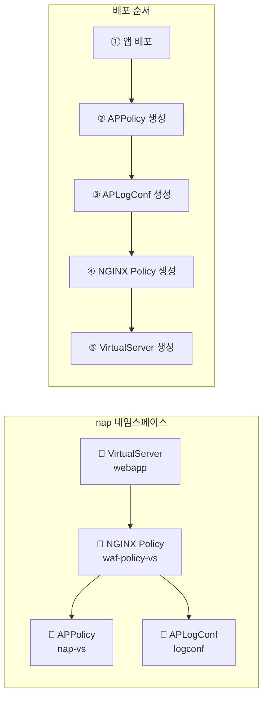

# Virtual Server CRD에 WAF 정책 적용하기

이 예제에서는 Kubernetes 내부에서 실행되는 웹 애플리케이션을 보호하기 위해 `Virtual Server` CRD의 일부로 [NGINX App Protect](https://www.nginx.com/products/nginx-app-protect/)를 사용합니다.

---

## 전체 아키텍처 구성도



---

## 요청 처리 흐름도



---

## 리소스 구성 관계도



---

## 사전 준비사항

> *데모를 실행하려면 VS Code 터미널을 사용하세요. VS Code는 `Access` 드롭다운 메뉴의 `bigip-01` 항목에 있습니다. 접속 방법은 <a href="https://raw.githubusercontent.com/F5EMEA/oltra/main/vscode.png">여기</a>를 클릭하여 확인하세요.*

작업 디렉토리를 `virtualserver`로 변경합니다.
```
cd ~/oltra/use-cases/app-protect/basic/virtualserver
```

---

## Step 1. 웹 애플리케이션 배포

애플리케이션 매니페스트와 서비스를 배포합니다:
```
kubectl create namespace nap
kubectl apply -f app.yml
```

---

## Step 2 - AP 정책(APPolicy) 배포

`APPolicy` 매니페스트는 App Protect WAF 정책을 생성하는 데 사용되며, 이후 VirtualServer, VirtualServerRoute, 또는 Ingress 리소스에서 참조됩니다. 기능을 활성화/비활성화하려면 APPolicy 리소스의 `spec` 필드에 원하는 정책을 추가하면 됩니다.

> **참고:** Policy JSON과 리소스 spec은 1:1 관계입니다.

예시: APPolicy.yml
```yml
apiVersion: appprotect.f5.com/v1beta1
kind: APPolicy
metadata:
  name: nap-vs
  namespace: nap
spec:
  policy:
    applicationLanguage: utf-8
    enforcementMode: blocking
    name: nap-vs
    template:
      name: POLICY_TEMPLATE_NGINX_BASE
```

이 예제에서는 주로 기본 템플릿을 참조하는 간단한 NAP 정책을 사용합니다. AP 정책에 대한 자세한 정보는 <a href="https://docs.nginx.com/nginx-app-protect/configuration-guide/configuration/#policy-configuration-overview">여기</a>에서 확인할 수 있습니다.

App Protect 정책을 생성합니다:
```
kubectl apply -f appolicy.yml
```

---

## Step 3 - AP 로그(APLogConf) 배포

`APLogConf` 리소스는 APPolicy와 함께 사용될 로깅 프로파일을 정의합니다. 아래와 같이 APLogConf 리소스의 `spec`에 설정을 정의합니다:

예시: APLogConf.yml
```yml
apiVersion: appprotect.f5.com/v1beta1
kind: APLogConf
metadata:
  name: logconf
  namespace: nap
spec:
  content:
    format: default
    max_message_size: 10k
    max_request_size: any
  filter:
    request_type: all
```

APLogConf 리소스를 생성합니다:
```
kubectl apply -f log.yml
```

---

## Step 4 - NGINX Policy 배포

NGINX Policy는 `waf` spec에서 APPolicy, APLogConf 프로파일, 그리고 사용할 로그 목적지를 정의하는 곳입니다.

예시: Policy.yml
```yml
apiVersion: k8s.nginx.org/v1
kind: Policy
metadata:
  name: waf-policy-vs
  namespace: nap
spec:
  waf:
    enable: true
    apPolicy: "nap-vs"
    securityLogs:
    - enable: true
      apLogConf: "logconf"
      logDest: "syslog:server=10.1.20.20:8515"
```

AP 정책, AP 로그 프로파일, 로그 목적지를 참조하는 NGINX 정책을 생성합니다:
```
kubectl apply -f policy.yml
```

---

## Step 5 - VirtualServer 리소스 설정

VirtualServer 리소스에서 방금 생성한 NGINX 정책을 참조하여 NGINX App Protect가 적용되도록 합니다.

예시: VirtualServer.yml
```yml
apiVersion: k8s.nginx.org/v1
kind: VirtualServer
metadata:
  name: webapp
  namespace: nap
spec:
  host: nap-vs.f5k8s.net
  policies:
  - name: waf-policy
  upstreams:
  - name: webapp
    service: webapp-svc
    port: 80
  routes:
  - path: /
    action:
      pass: webapp
```

VirtualServer 리소스를 생성합니다:
```
kubectl apply -f virtual-server.yml
```

---

## Step 6 - 애플리케이션 테스트

curl로 webapp 서비스에 접근하여 애플리케이션을 테스트합니다.

### ✅ 정상 요청 테스트
```
curl http://nap-vs.f5k8s.net/

#####################  Expected output  #######################
Server address: 10.244.140.109:8080
Server name: webapp-7586895968-r26zn
Date: 12/Sep/2022:14:12:25 +0000
URI: /
Request ID: 0495d6a17797ea9776120d5f4af10c1a
```

### 🚫 악성 요청 테스트 (WAF 차단 확인)
```
curl "http://nap-vs.f5k8s.net/<script>"

#####################  Expected output  #######################
<html>
  <head>
    <title>Request Rejected</title>
  </head>
  <body>
    The requested URL was rejected. Please consult with your administrator.<br><br>
    Your support ID is: 4045204596866416688<br><br>
    <a href='javascript:history.back();'>[Go Back]</a>
  </body>
</html>
```

> 💡 **결과 설명:** `<script>` 태그를 포함한 요청은 XSS(크로스 사이트 스크립팅) 공격으로 인식되어 WAF에 의해 차단됩니다. 응답에 포함된 **Support ID**는 로그 추적에 사용됩니다.

---

## Step 7 - 로그 확인

로그를 확인하려면 Grafana에 로그인하여 Support ID로 검색합니다. NAP Grafana 대시보드에 관한 자세한 정보는 [**NAP Dashboard**](https://github.com/F5EMEA/oltra/tree/main/use-cases/app-protect/monitoring) 실습을 참조하세요.

---

***환경 정리 (선택 사항)***
```
kubectl delete -f .
```
