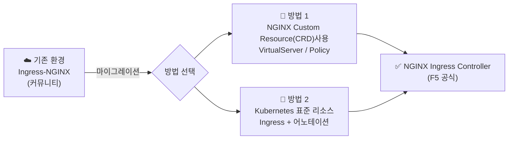
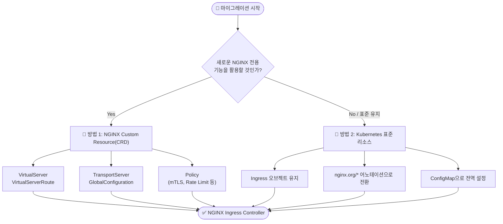
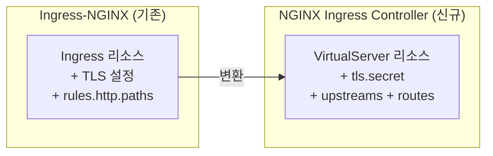
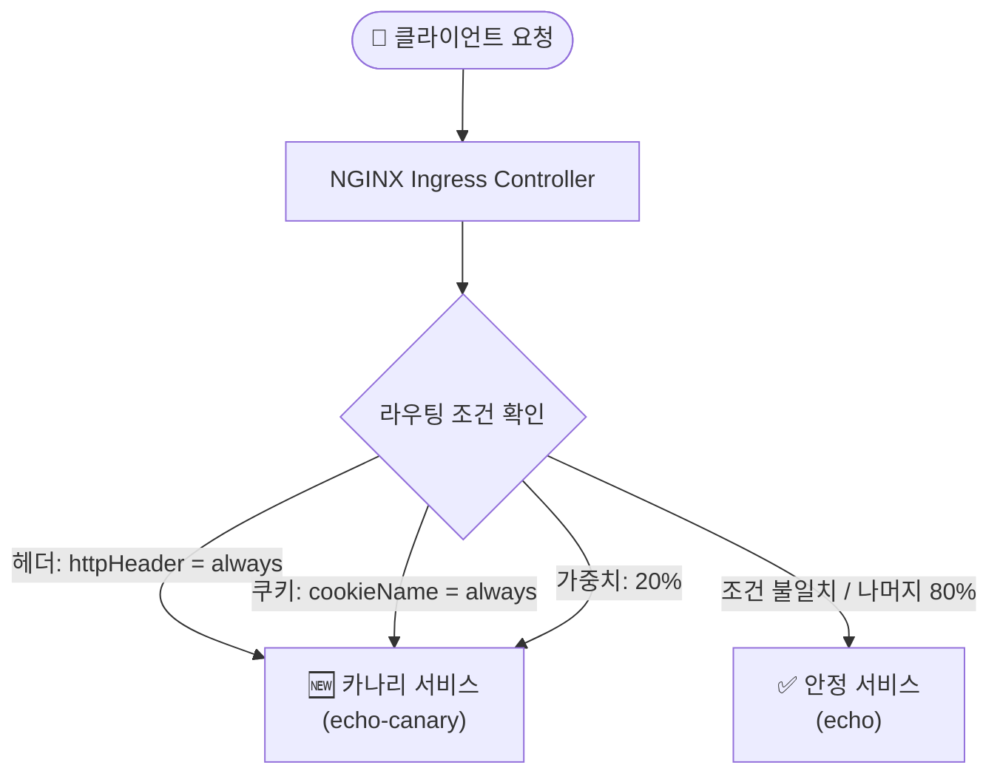
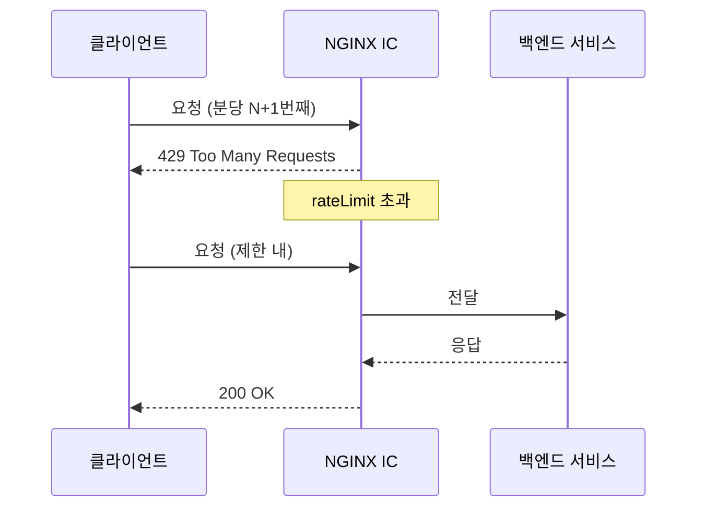
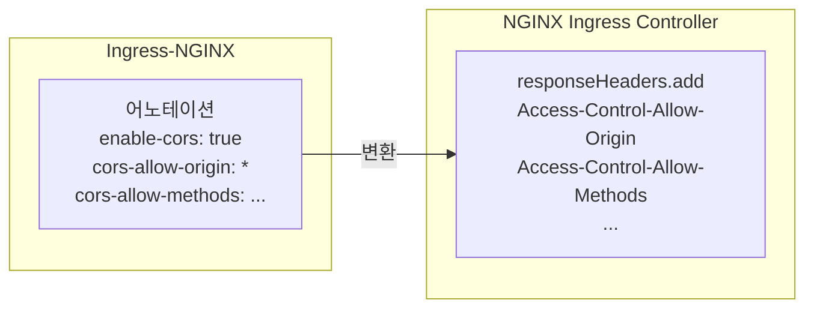
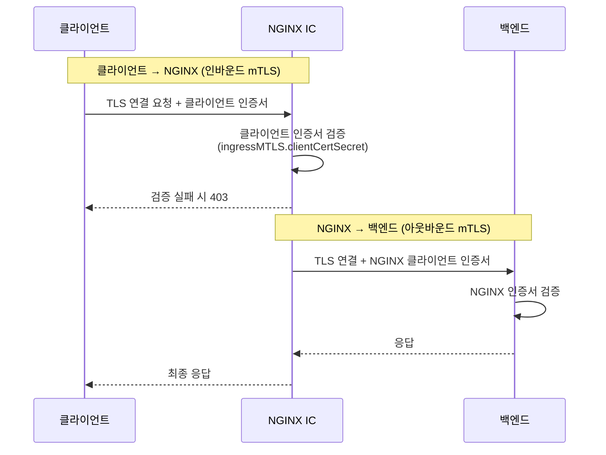
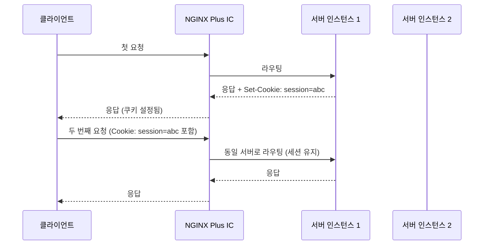
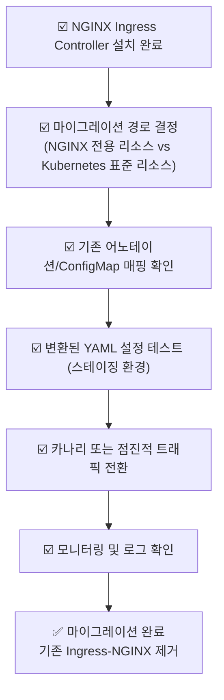

# Kubernetes Ingress-NGINX → NGINX Ingress Controller 마이그레이션 가이드

> 원문: [NGINX 공식 문서](https://docs.nginx.com/nginx-ingress-controller/install/migrate-ingress-nginx/)
> 번역 및 재구성: 한국어 GitHub 공유용

---

## 📌 목차

1. [개요](#개요)
2. [사전 요구사항](#사전-요구사항)
3. [마이그레이션 경로 선택](#마이그레이션-경로-선택)
4. [기본 설정 변환: SSL/TLS 및 경로 라우팅](#기본-설정-변환-ssltls-및-경로-라우팅)
5. [카나리(Canary) 배포 설정](#카나리canary-배포-설정)
6. [트래픽 제어](#트래픽-제어)
7. [CORS 설정](#cors-설정)
8. [프록시 & 로드밸런싱](#프록시--로드밸런싱)
9. [mTLS 인증](#mtls-인증)
10. [세션 유지 (NGINX Plus 전용)](#세션-유지-nginx-plus-전용)
11. [어노테이션 전체 매핑 표](#어노테이션-전체-매핑-표)
12. [ConfigMap 키 전체 매핑 표](#configmap-키-전체-매핑-표)

---

## 개요

**Kubernetes Ingress-NGINX**는 Kubernetes SIGs 커뮤니티에서 관리하는 인그레스 컨트롤러이고, **NGINX Ingress Controller**는 F5/NGINX에서 공식 제공하는 인그레스 컨트롤러입니다.

이 두 컨트롤러는 이름이 비슷하지만 **설정 방식, 리소스 정의, 어노테이션 체계가 다릅니다.**
이 가이드는 기존 Ingress-NGINX 환경에서 NGINX Ingress Controller로 전환하는 방법을 설명합니다.



---

## 사전 요구사항

마이그레이션을 진행하기 전에 아래 사항을 준비해야 합니다.

| 요구사항 | 설명 |
|----------|------|
| Ingress Controller 기본 지식 | Ingress Controller의 동작 방식에 대한 이해 |
| 동시 운영 환경 | 기존 Ingress-NGINX와 새 NGINX Ingress Controller가 **같은 클러스터**에서 동시에 실행 가능해야 함 |

> ⚠️ **중요**: 마이그레이션 중에는 두 컨트롤러가 동시에 실행됩니다. 트래픽 전환은 점진적으로 진행할 수 있습니다.

---

## 마이그레이션 경로 선택

NGINX Ingress Controller로 이전할 때 두 가지 방식 중 하나를 선택할 수 있습니다.



### 두 경로 비교

| 항목 | 방법 1: NGINX 전용 리소스 | 방법 2: Kubernetes 표준 리소스 |
|------|--------------------------|-------------------------------|
| **사용 리소스** | VirtualServer, TransportServer, Policy 등 CRD | 표준 Ingress 오브젝트 |
| **설정 방식** | YAML 리소스로 세밀한 제어 | 어노테이션 + ConfigMap |
| **NGINX 기능 활용도** | 높음 (고급 라우팅, mTLS 등 완전 지원) | 중간 (어노테이션 범위 내) |
| **기존 설정 재사용** | 낮음 (설정 전면 재작성 필요) | 높음 (어노테이션만 변경) |
| **권장 대상** | 신규 구성 또는 고급 기능 필요 시 | 빠른 마이그레이션 필요 시 |

---

## 기본 설정 변환: SSL/TLS 및 경로 라우팅

가장 기본적인 SSL 종료(termination)와 경로 기반 라우팅 설정의 변환 예시입니다.



**[기존] Ingress-NGINX**

```yaml
apiVersion: networking.k8s.io/v1
kind: Ingress
metadata:
  name: nginx-test
spec:
  tls:
    - hosts:
        - foo.bar.com
      secretName: tls-secret
  rules:
    - host: foo.bar.com
      http:
        paths:
          - path: /login
            backend:
              serviceName: login-svc
              servicePort: 80
          - path: /billing
            backend:
              serviceName: billing-svc
              servicePort: 80
```

**[신규] NGINX Ingress Controller — VirtualServer 리소스**

```yaml
apiVersion: k8s.nginx.org/v1
kind: VirtualServer
metadata:
  name: nginx-test
spec:
  host: foo.bar.com
  tls:
    secret: tls-secret        # ← spec.tls[].secretName 에서 변경
  upstreams:                  # ← 서비스를 업스트림으로 먼저 정의
    - name: login
      service: login-svc
      port: 80
    - name: billing
      service: billing-svc
      port: 80
  routes:                     # ← rules.http.paths 에서 변경
    - path: /login
      action:
        pass: login
    - path: /billing
      action:
        pass: billing
```

> 💡 **핵심 변경점**: 기존에는 `rules` 하위에 직접 서비스를 지정했지만, VirtualServer는 `upstreams`에서 서비스를 먼저 정의하고 `routes`에서 참조하는 구조입니다.

---

## 카나리(Canary) 배포 설정

카나리 배포는 새 버전을 일부 트래픽에만 먼저 적용하는 점진적 배포 전략입니다.



### 1. 헤더 기반 카나리

**[기존] Ingress-NGINX 어노테이션**

```yaml
nginx.ingress.kubernetes.io/canary: "true"
nginx.ingress.kubernetes.io/canary-by-header: "httpHeader"
```

**[신규] NGINX Ingress Controller — VirtualServer `matches`**

```yaml
# VirtualServer spec.routes 내부
routes:
  - path: /
    matches:
      - conditions:
          - header: httpHeader
            value: never        # "never" → 안정 버전으로 강제
        action:
          pass: echo
      - conditions:
          - header: httpHeader
            value: always       # "always" → 카나리 버전으로 강제
        action:
          pass: echo-canary
    action:
      pass: echo                # 조건 불일치 시 기본값 (안정 버전)
```

### 2. 헤더 + 특정 값 기반 카나리

**[기존]**

```yaml
nginx.ingress.kubernetes.io/canary: "true"
nginx.ingress.kubernetes.io/canary-by-header: "httpHeader"
nginx.ingress.kubernetes.io/canary-by-header-value: "my-value"
```

**[신규]**

```yaml
matches:
  - conditions:
      - header: httpHeader
        value: my-value         # 특정 헤더 값일 때 카나리로 라우팅
    action:
      pass: echo-canary
action:
  pass: echo
```

### 3. 쿠키 기반 카나리

**[기존]**

```yaml
nginx.ingress.kubernetes.io/canary: "true"
nginx.ingress.kubernetes.io/canary-by-cookie: "cookieName"
```

**[신규]**

```yaml
matches:
  - conditions:
      - cookie: cookieName
        value: never
    action:
      pass: echo
  - conditions:
      - cookie: cookieName
        value: always
    action:
      pass: echo-canary
action:
  pass: echo
```

---

## 트래픽 제어

### 주요 변환 매핑

| 기능 | Ingress-NGINX 어노테이션 | NGINX Ingress Controller |
|------|--------------------------|--------------------------|
| **커스텀 HTTP 오류** | `nginx.ingress.kubernetes.io/custom-http-errors: "503"` | `errorPages` 블록 사용 |
| **연결 수 제한** | `nginx.ingress.kubernetes.io/limit-connections: "N"` | `http-snippets` + `location-snippets` + `limit_conn` |
| **분당 요청 제한 (RPM)** | `nginx.ingress.kubernetes.io/limit-rpm: "N"` | `rateLimit.rate: N/m` |
| **초당 요청 제한 (RPS)** | `nginx.ingress.kubernetes.io/limit-rps: "N"` | `rateLimit.rate: N/s` |
| **URI 재작성** | `nginx.ingress.kubernetes.io/rewrite-target: "/URI"` | `rewritePath: "/URI"` |

### 속도 제한(Rate Limit) 예시



**[기존] Ingress-NGINX**

```yaml
nginx.ingress.kubernetes.io/limit-rpm: "60"
```

**[신규] NGINX Ingress Controller — VirtualServer**

```yaml
# Policy 리소스 정의
apiVersion: k8s.nginx.org/v1
kind: Policy
metadata:
  name: rate-limit-policy
spec:
  rateLimit:
    rate: 60r/m        # 분당 60 요청
    burst: 10          # 버스트 허용량
    zoneSize: 10m

---
# VirtualServer에서 참조
routes:
  - path: /
    policies:
      - name: rate-limit-policy
    action:
      pass: my-service
```

### 커스텀 에러 페이지

**[기존]**

```yaml
nginx.ingress.kubernetes.io/custom-http-errors: "503"
```

**[신규]**

```yaml
# VirtualServer spec 내부
routes:
  - path: /
    errorPages:
      - codes: [503]
        redirect:
          code: 301
          url: https://fallback.example.com
```

---

## CORS 설정

CORS(Cross-Origin Resource Sharing) 설정은 어노테이션 방식에서 응답 헤더 추가 방식으로 변환됩니다.



**[기존] Ingress-NGINX**

```yaml
nginx.ingress.kubernetes.io/enable-cors: "true"
nginx.ingress.kubernetes.io/cors-allow-credentials: "true"
nginx.ingress.kubernetes.io/cors-allow-headers: "X-Forwarded-For"
nginx.ingress.kubernetes.io/cors-allow-methods: "PUT, GET, POST, OPTIONS"
nginx.ingress.kubernetes.io/cors-allow-origin: "*"
nginx.ingress.kubernetes.io/cors-max-age: "3600"
```

**[신규] NGINX Ingress Controller — VirtualServer**

```yaml
routes:
  - path: /
    responseHeaders:
      add:
        - name: Access-Control-Allow-Credentials
          value: "true"
        - name: Access-Control-Allow-Headers
          value: "X-Forwarded-For"
        - name: Access-Control-Allow-Methods
          value: "PUT, GET, POST, OPTIONS"
        - name: Access-Control-Allow-Origin
          value: "*"
        - name: Access-Control-Max-Age
          value: "3600"
    action:
      pass: my-service
```

---

## 프록시 & 로드밸런싱

### 어노테이션 변환 매핑

| Ingress-NGINX 어노테이션 | NGINX Ingress Controller (업스트림) | NGINX 디렉티브 |
|--------------------------|-------------------------------------|---------------|
| `nginx.ingress.kubernetes.io/load-balance` | `lb-method` | `random two least_conn` |
| `nginx.ingress.kubernetes.io/proxy-buffering` | `buffering` | `proxy_buffering` |
| `nginx.ingress.kubernetes.io/proxy-buffers-number` | `buffers.number` | `proxy_buffers` |
| `nginx.ingress.kubernetes.io/proxy-buffer-size` | `buffers.size` | `proxy_buffer_size` |
| `nginx.ingress.kubernetes.io/proxy-connect-timeout` | `connect-timeout` | `proxy_connect_timeout` |
| `nginx.ingress.kubernetes.io/proxy-next-upstream` | `next-upstream` | `proxy_next_upstream` |
| `nginx.ingress.kubernetes.io/proxy-next-upstream-timeout` | `next-upstream-timeout` | `proxy_next_upstream_timeout` |
| `nginx.ingress.kubernetes.io/proxy-read-timeout` | `read-timeout` | `proxy_read_timeout` |
| `nginx.ingress.kubernetes.io/proxy-send-timeout` | `send-timeout` | `proxy_send_timeout` |
| `nginx.ingress.kubernetes.io/service-upstream` | `use-cluster-ip` | — |

### VirtualServer 업스트림 설정 예시

```yaml
apiVersion: k8s.nginx.org/v1
kind: VirtualServer
metadata:
  name: my-app
spec:
  host: app.example.com
  upstreams:
    - name: my-service
      service: my-svc
      port: 80
      # 로드밸런싱 방식
      lb-method: least_conn
      # 타임아웃 설정
      connect-timeout: 10s
      read-timeout: 30s
      send-timeout: 30s
      # 버퍼링
      buffering: true
      buffers:
        number: 8
        size: 4k
      # 다음 업스트림 시도
      next-upstream: error timeout
      next-upstream-timeout: 5s
  routes:
    - path: /
      action:
        pass: my-service
```

---

## mTLS 인증

mTLS(Mutual TLS)는 클라이언트와 서버 양방향 인증을 제공합니다.
NGINX Ingress Controller에서는 **Policy 리소스**를 통해 설정합니다.



### 클라이언트 인증서 검증 (Ingress mTLS)

**[기존] Ingress-NGINX**

```yaml
nginx.ingress.kubernetes.io/auth-tls-secret: "default/client-ca-secret"
nginx.ingress.kubernetes.io/auth-tls-verify-client: "on"
nginx.ingress.kubernetes.io/auth-tls-verify-depth: "1"
```

**[신규] NGINX Ingress Controller — Policy 리소스**

```yaml
apiVersion: k8s.nginx.org/v1
kind: Policy
metadata:
  name: ingress-mtls-policy
spec:
  ingressMTLS:
    clientCertSecret: client-ca-secret   # CA 인증서가 담긴 Secret
    verifyClient: "on"                   # 클라이언트 인증 필수
    verifyDepth: 1                       # 인증서 체인 깊이

---
# VirtualServer에서 정책 참조
apiVersion: k8s.nginx.org/v1
kind: VirtualServer
metadata:
  name: my-app
spec:
  host: app.example.com
  policies:
    - name: ingress-mtls-policy
  tls:
    secret: server-tls-secret
  upstreams:
    - name: my-service
      service: my-svc
      port: 8080
  routes:
    - path: /
      action:
        pass: my-service
```

### 백엔드 인증서 검증 (Egress mTLS)

**[기존] Ingress-NGINX**

```yaml
nginx.ingress.kubernetes.io/proxy-ssl-secret: "default/backend-secret"
nginx.ingress.kubernetes.io/proxy-ssl-verify: "on"
nginx.ingress.kubernetes.io/proxy-ssl-verify-depth: "1"
nginx.ingress.kubernetes.io/proxy-ssl-protocols: "TLSv1.2"
nginx.ingress.kubernetes.io/proxy-ssl-ciphers: "DEFAULT"
nginx.ingress.kubernetes.io/proxy-ssl-name: "backend.internal"
nginx.ingress.kubernetes.io/proxy-ssl-server-name: "on"
```

**[신규] NGINX Ingress Controller — Policy 리소스**

```yaml
apiVersion: k8s.nginx.org/v1
kind: Policy
metadata:
  name: egress-mtls-policy
spec:
  egressMTLS:
    tlsSecret: backend-secret            # 백엔드 연결에 사용할 클라이언트 인증서
    verifyServer: true                   # 백엔드 서버 인증서 검증
    verifyDepth: 1
    protocols: TLSv1.2
    ciphers: DEFAULT
    sslName: backend.internal
    serverName: true
```

---

## 세션 유지 (NGINX Plus 전용)

> ⚠️ 이 기능은 **NGINX Plus** 라이선스가 필요합니다. NGINX 오픈소스 버전에서는 사용 불가합니다.



**[기존] Ingress-NGINX**

```yaml
nginx.ingress.kubernetes.io/affinity: "cookie"
nginx.ingress.kubernetes.io/session-cookie-name: "MY_SESSION"
nginx.ingress.kubernetes.io/session-cookie-expires: "3600"
nginx.ingress.kubernetes.io/session-cookie-path: "/app"
nginx.ingress.kubernetes.io/session-cookie-secure: "true"
```

**[신규] NGINX Ingress Controller — VirtualServer 업스트림**

```yaml
upstreams:
  - name: my-service
    service: my-svc
    port: 80
    sessionCookie:
      enable: true
      name: MY_SESSION          # 쿠키 이름
      expires: 1h               # 만료 시간
      path: /app                # 쿠키 적용 경로
      secure: true              # HTTPS 전용
```

---

## 어노테이션 전체 매핑 표

### 기본 어노테이션

| Ingress-NGINX 어노테이션 | NGINX Ingress Controller 어노테이션 | NGINX 디렉티브 |
|--------------------------|--------------------------------------|---------------|
| `nginx.ingress.kubernetes.io/configuration-snippet` | `nginx.org/location-snippets` | — |
| `nginx.ingress.kubernetes.io/load-balance` | `nginx.org/lb-method` | `random two least_conn` |
| `nginx.ingress.kubernetes.io/proxy-buffering` | `nginx.org/proxy-buffering` | `proxy_buffering` |
| `nginx.ingress.kubernetes.io/proxy-buffers-number` | `nginx.org/proxy-buffers` | `proxy_buffers` |
| `nginx.ingress.kubernetes.io/proxy-buffer-size` | `nginx.org/proxy-buffer-size` | `proxy_buffer_size` |
| `nginx.ingress.kubernetes.io/proxy-busy-buffers-size` | `nginx.org/proxy-busy-buffers-size` | `proxy_busy_buffers_size` |
| `nginx.ingress.kubernetes.io/client-body-buffer-size` | `nginx.org/client-body-buffer-size` | `client_body_buffer_size` |
| `nginx.ingress.kubernetes.io/proxy-connect-timeout` | `nginx.org/proxy-connect-timeout` | `proxy_connect_timeout` |
| `nginx.ingress.kubernetes.io/proxy-read-timeout` | `nginx.org/proxy-read-timeout` | `proxy_read_timeout` |
| `nginx.ingress.kubernetes.io/proxy-send-timeout` | `nginx.org/proxy-send-timeout` | `proxy_send_timeout` |
| `nginx.ingress.kubernetes.io/rewrite-target` | `nginx.org/rewrite-target` | `rewrite` |
| `nginx.ingress.kubernetes.io/ssl-ciphers` | `nginx.org/ssl-ciphers` | `ssl_ciphers` |
| `nginx.ingress.kubernetes.io/ssl-prefer-server-ciphers` | `nginx.org/ssl-prefer-server-ciphers` | `ssl_prefer_server_ciphers` |
| `nginx.ingress.kubernetes.io/server-snippet` | `nginx.org/server-snippets` | — |
| `nginx.ingress.kubernetes.io/ssl-redirect` | `ingress.kubernetes.io/ssl-redirect` | — |

### 백엔드 프로토콜

| Ingress-NGINX | NGINX Ingress Controller | 설명 |
|---------------|--------------------------|------|
| `nginx.ingress.kubernetes.io/backend-protocol: "HTTPS"` | `nginx.org/ssl-services: "서비스명"` | HTTPS 백엔드 |
| `nginx.ingress.kubernetes.io/backend-protocol: "GRPC"` | `nginx.org/grpc-services: "서비스명"` | gRPC 백엔드 |
| `nginx.ingress.kubernetes.io/backend-protocol: "GRPCS"` | `nginx.org/ssl-services` + `nginx.org/grpc-services` | gRPCS 백엔드 |

---

## ConfigMap 키 전체 매핑 표

ConfigMap은 컨트롤러 전역 설정을 담당합니다. 아래 표는 키 이름 변환 매핑입니다.

### 로깅

| Ingress-NGINX ConfigMap 키 | NGINX Ingress Controller ConfigMap 키 |
|---------------------------|---------------------------------------|
| `disable-access-log` | `access-log-off` |
| `error-log-level` | `error-log-level` |
| `log-format-escape-json` | `log-format-escaping: "json"` |
| `log-format-stream` | `stream-log-format` |
| `log-format-upstream` | `log-format` |

### SSL/TLS

| Ingress-NGINX ConfigMap 키 | NGINX Ingress Controller ConfigMap 키 |
|---------------------------|---------------------------------------|
| `hsts` | `hsts` |
| `hsts-include-subdomains` | `hsts-include-subdomains` |
| `hsts-max-age` | `hsts-max-age` |
| `ssl-ciphers` | `ssl-ciphers` |
| `ssl-dh-param` | `ssl-dhparam-file` |
| `ssl-protocols` | `ssl-protocols` |
| `ssl-redirect` | `ssl-redirect` |
| `use-http2` | `http2` |
| `use-proxy-protocol` | `proxy-protocol` |

### 프록시 & 버퍼링

| Ingress-NGINX ConfigMap 키 | NGINX Ingress Controller ConfigMap 키 |
|---------------------------|---------------------------------------|
| `proxy-body-size` | `client-max-body-size` |
| `client-body-buffer-size` | `client-body-buffer-size` |
| `proxy-buffering` | `proxy-buffering` |
| `proxy-buffers-number` | `proxy-buffers: number size` |
| `proxy-buffer-size` | `proxy-buffers: number size` |
| `proxy-connect-timeout` | `proxy-connect-timeout` |
| `proxy-read-timeout` | `proxy-read-timeout` |
| `proxy-send-timeout` | `proxy-send-timeout` |

### 연결 & Keepalive

| Ingress-NGINX ConfigMap 키 | NGINX Ingress Controller ConfigMap 키 |
|---------------------------|---------------------------------------|
| `keep-alive` | `keepalive-timeout` |
| `keep-alive-requests` | `keepalive-requests` |
| `upstream-keepalive-connections` | `keepalive` |

### 워커 & 성능

| Ingress-NGINX ConfigMap 키 | NGINX Ingress Controller ConfigMap 키 |
|---------------------------|---------------------------------------|
| `max-worker-connections` | `worker-connections` |
| `max-worker-open-files` | `worker-rlimit-nofile` |
| `worker-cpu-affinity` | `worker-cpu-affinity` |
| `worker-processes` | `worker-processes` |
| `worker-shutdown-timeout` | `worker-shutdown-timeout` |

### 기타

| Ingress-NGINX ConfigMap 키 | NGINX Ingress Controller ConfigMap 키 |
|---------------------------|---------------------------------------|
| `http-snippet` | `http-snippets` |
| `load-balance` | `lb-method` |
| `location-snippet` | `location-snippets` |
| `main-snippet` | `main-snippets` |
| `server-name-hash-bucket-size` | `server-names-hash-bucket-size` |
| `proxy-headers-hash-max-size` | `server-names-hash-max-size` |
| `server-snippet` | `server-snippets` |
| `server-tokens` | `server-tokens` |
| `variables-hash-bucket-size` | `variables-hash-bucket-size` |

---

## 마이그레이션 체크리스트

마이그레이션을 완료하기 전에 아래 항목을 확인하세요.



---

## 참고 링크

- [NGINX Ingress Controller 공식 문서](https://docs.nginx.com/nginx-ingress-controller/)
- [VirtualServer 리소스 레퍼런스](https://docs.nginx.com/nginx-ingress-controller/configuration/virtualserver-and-virtualserverroute-resources/)
- [Policy 리소스 레퍼런스](https://docs.nginx.com/nginx-ingress-controller/configuration/policy-resource/)
- [원문 마이그레이션 가이드](https://docs.nginx.com/nginx-ingress-controller/install/migrate-ingress-nginx/)
